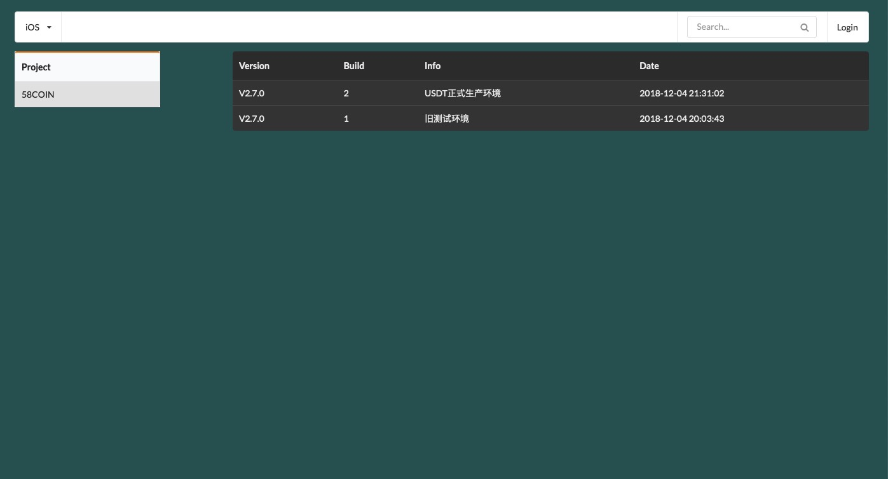
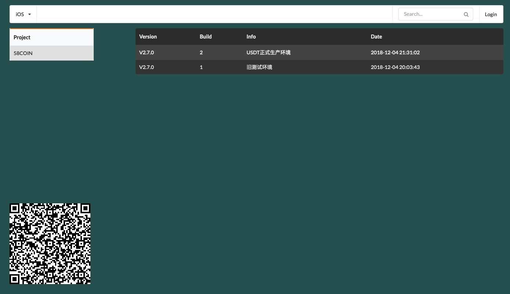

# AutoPackingShell
auto-packing ipa for iOS  

iOS 自动打包 ipa，且自动上传分发平台

`其一、天朝政策原因，有些内测平台不予支持（比如：币圈）`

`其二、不想依赖于第三方平台`

`其三、想玩玩的屌丝们`

**于是自定义分发服务器应用而生，简单方便，你值得拥有**

[自定义分发管理平台请移步](https://github.com/MayerFan/auto-pp)
效果图预览




## 多环境， 多配置
    1. 多个build环境支持
    2. 多个选项自由配置
    3. 轻松实现一套脚本，不同配置需求

## 功能
1. 支持`xcworkspace`和`xcodeproj`两种类型工程
2. 支持自动化`clean`、`build`、`archive`工程导出`ipa`
3. 支持基本的`debug` `release` 和 `多环境`的编译模式
4. 支持导出`app-store`, `ad-hoc`, `enterprise`, `development`包
5. 支持ipa自动上传内测平台（推荐自定义服务平台）

## 使用
1. 把文件夹`AutoPacking`拖拽到您的工程根目录
2. 在`autopacking.sh`修改您所支持的配置项
3. **必须配置您自己的plist文件** [关于plist文件的获取](#plist)

## 概念释义
1. xcodebuild 命令

	```
	xcodebuild clean          //等价于Xcode下点击Product -> Clean
	xcodebuild -xcworkspace   //等同于xcworkspace工程 command+B
	xcodebuild -xcodeproj 	  //等同于xcworkspace工程 command+B
	xcodebuild archive 	      //等同于Xcode下点击Product -> Archive
	xcodebuild -exportArchive //等同于点击 export
	```
2. 关于证书

	`xcodebuild` 默认是采用`XCODE`配置好的`证书`和`描述文件`
	
3. 关于脚本

	* 配置`Target`

		用于项目中有多个target的情况。如果只有一个默认可以注释掉
	* 配置项目名称

		有时候工程名称不一定是官方项目名称。因此对于自动打包上传到分发平台的时候可用的项目名称
	* 配置构建模式

		默认只有`debug`和`release`模式。脚本中是多环境的配置
		关于多环境配置请百度`build configuration`
		关于默认模式 请使用下面代码替换
		
		```
		options=("1.TestDebug" "2.TestRelease" "3.DistributionDebug" "4.DistributionRelease") 替换为：
		options=("1.Debug" "2.Release")
		
		```
	* <span id="plist"></span>关于各个打包方式下的plist文件的获取

		方式1： 
		
			用xcode工具`Archive`出导出包。取出已导出文件夹下的`ExportOptions.plist`文件。
			修改脚本中的命名后，直接替换即可
			
		方式2：
		
			仍然`Archive`出导出包，取出`ExportOptions.plist`中的teamID 直接替换脚本中的teamID即可。		

## xcodebuild的使用

1. 基本命令格式解释。

	方括号`[]`: 内部元素可选。
	
	尖括号`<>`: 内部元素必需。
	
	管道`|`: 或者。
	
	省略号`...`: 等等。前述元素可以在命令行中多次重复。

```
	 xcodebuild 
	   [-project <projectname>]                //指定项目名称  
	   [[-target <targetname>]...|-alltargets] //指定多个target名称或所有的taregets 
	   [-configuration <configurationname>]    //指定build构建配置。比如`debug`、`release`
	   [-arch <architecture>]...               //指定多个架构支持
	   [-sdk [<sdkname>|<sdkpath>]]            //指定使用的sdk
	   [-showBuildSettings [-json]]	          //显示buildsetting配置
	   [<buildsetting>=<value>]...             //设置buildsetting
	   [<buildaction>]...                      //构建方式：`build`、`analyze`、`archive`、`test`、`profile`	            
     xcodebuild 
     	[-project <projectname>] 
     	-scheme <schemeName>                   //指定scheme。指定scheme就相当于指定了固定的target
     	[-destination <destinationspecifier>]... 
     	[-configuration <configurationname>] 
     	[-arch <architecture>]... 
     	[-sdk [<sdkname>|<sdkpath>]] 
     	[-showBuildSettings [-json]] 
     	[-showdestinations]                    //显示所有可支持的目标设备
     	[<buildsetting>=<value>]... 
     	[<buildaction>]...
     xcodebuild 
     	-workspace <workspacename>             //指定工作空间。用于pod打开xcode形式
     	-scheme <schemeName>                   
     	[-destination <destinationspecifier>]... 
     	[-configuration <configurationname>] 
     	[-arch <architecture>]... 
     	[-sdk [<sdkname>|<sdkpath>]] 
     	[-showBuildSettings] 
     	[-showdestinations] 
     	[<buildsetting>=<value>]... 
     	[<buildaction>]...
     xcodebuild 
     	-version                          
     	[-sdk [<sdkfullpath>|<sdkname>] 
     	[-json] 
     	[<infoitem>]]
     xcodebuild 
     	-list 
     	[[-project <projectname>]|[-workspace <workspacename>]] 
     	[-json]
     xcodebuild 
     	-showsdks 
     	[-json]
     xcodebuild 
     	-exportArchive                       //归档导出ipa
     	-archivePath <xcarchivepath>         //已经导出归档的路径
     	[-exportPath <destinationpath>]      //ipa保存路径 
     	-exportOptionsPlist <plistpath>      //导出ipa的时候需要的配置plist。
     xcodebuild 
     	-exportNotarizedApp 
     	-archivePath <xcarchivepath> 
     	-exportPath <destinationpath>
     xcodebuild 
     	-exportLocalizations 
     	-localizationPath <path> 
     	-project <projectname> 
     	[-exportLanguage <targetlanguage>...]
     xcodebuild 
     	-importLocalizations 
     	-localizationPath <path> 
     	-project <projectname>
     xcodebuild 
     	-resolvePackageDependencies 
     	[-project <projectname>|-workspace <workspacename>] 
     	-clonedSourcePackagesDirPath <path>

Options:
    -usage                                                   print brief usage
    -help                                                    print complete usage
    -verbose                                                 provide additional status output
    -license                                                 show the Xcode and SDK license agreements
    -checkFirstLaunchStatus                                  Check if any First Launch tasks need to be performed
    -runFirstLaunch                                          install packages and agree to the license
    -project NAME                                            build the project NAME
    -target NAME                                             build the target NAME
    -alltargets                                              build all targets
    -workspace NAME                                          build the workspace NAME
    -scheme NAME                                             build the scheme NAME
    -configuration NAME                                      use the build configuration NAME for building each target
    -xcconfig PATH                                           apply the build settings defined in the file at PATH as overrides
    -arch ARCH                                               build each target for the architecture ARCH; this will override architectures defined in the project
    -sdk SDK                                                 use SDK as the name or path of the base SDK when building the project
    -toolchain NAME                                          use the toolchain with identifier or name NAME
    -destination DESTINATIONSPECIFIER                        use the destination described by DESTINATIONSPECIFIER (a comma-separated set of key=value pairs describing the destination to use)
    -destination-timeout TIMEOUT                             wait for TIMEOUT seconds while searching for the destination device
    -parallelizeTargets                                      build independent targets in parallel
    -jobs NUMBER                                             specify the maximum number of concurrent build operations
    -maximum-concurrent-test-device-destinations NUMBER      the maximum number of device destinations to test on concurrently
    -maximum-concurrent-test-simulator-destinations NUMBER   the maximum number of simulator destinations to test on concurrently
    -parallel-testing-enabled YES|NO                         overrides the per-target setting in the scheme
    -parallel-testing-worker-count NUMBER                    the exact number of test runners that will be spawned during parallel testing
    -maximum-parallel-testing-workers NUMBER                 the maximum number of test runners that will be spawned during parallel testing
    -dry-run                                                 do everything except actually running the commands
    -quiet                                                   do not print any output except for warnings and errors
    -hideShellScriptEnvironment                              don't show shell script environment variables in build log
    -showsdks                                                display a compact list of the installed SDKs
    -showdestinations                                        display a list of destinations
    -showBuildSettings                                       display a list of build settings and values
    -list                                                    lists the targets and configurations in a project, or the schemes in a workspace
    -find-executable NAME                                    display the full path to executable NAME in the provided SDK and toolchain
    -find-library NAME                                       display the full path to library NAME in the provided SDK and toolchain
    -version                                                 display the version of Xcode; with -sdk will display info about one or all installed SDKs
    -enableAddressSanitizer YES|NO                           turn the address sanitizer on or off
    -enableThreadSanitizer YES|NO                            turn the thread sanitizer on or off
    -enableUndefinedBehaviorSanitizer YES|NO                 turn the undefined behavior sanitizer on or off
    -resultBundlePath PATH                                   specifies the directory where a result bundle describing what occurred will be placed
    -clonedSourcePackagesDirPath PATH                        specifies the directory to which remote source packages are fetch or expected to be found
    -derivedDataPath PATH                                    specifies the directory where build products and other derived data will go
    -archivePath PATH                                        specifies the directory where any created archives will be placed, or the archive that should be exported
    -exportArchive                                           specifies that an archive should be exported
    -exportNotarizedApp                                      export an archive that has been notarized by Apple
    -exportOptionsPlist PATH                                 specifies a path to a plist file that configures archive exporting
    -enableCodeCoverage YES|NO                               turn code coverage on or off when testing
    -exportPath PATH                                         specifies the destination for the product exported from an archive
    -skipUnavailableActions                                  specifies that scheme actions that cannot be performed should be skipped instead of causing a failure
    -exportLocalizations                                     exports completed and outstanding project localizations
    -importLocalizations                                     imports localizations for a project, assuming any necessary localized resources have been created in Xcode
    -localizationPath                                        specifies a path to XLIFF localization files
    -exportLanguage                                          specifies multiple optional ISO 639-1 languages included in a localization export
    -xctestrun                                               specifies a path to a test run specification
    -only-testing:TEST-IDENTIFIER                            constrains testing by specifying tests to include, and excluding other tests
    -skip-testing:TEST-IDENTIFIER                            constrains testing by specifying tests to exclude, but including other tests
    -testLanguage                                            constrains testing by specifying ISO 639-1 language in which to run the tests
    -testRegion                                              constrains testing by specifying ISO 3166-1 region in which to run the tests
    -resolvePackageDependencies                              resolves any package dependencies referenced by the project or workspace
    -json                                                    output as JSON (note: -json implies -quiet)
    -allowProvisioningUpdates                                Allow xcodebuild to communicate with the Apple Developer website. For automatically signed targets, xcodebuild will create and update profiles, app IDs, and certificates. For manually signed targets, xcodebuild will download missing or updated provisioning profiles. Requires a developer account to have been added in Xcode's Accounts preference pane.
    -allowProvisioningDeviceRegistration                     Allow xcodebuild to register your destination device on the developer portal if necessary. This flag only takes effect if -allowProvisioningUpdates is also passed.
    -showBuildTimingSummary                                  display a report of the timings of all the commands invoked during the build

Available keys for -exportOptionsPlist:

	compileBitcode : Bool

		For non-App Store exports, should Xcode re-compile the app from bitcode? Defaults to YES.

	destination : String

		Determines whether the app is exported locally or uploaded to Apple. Options are export or upload. The available options vary based on the selected distribution method. Defaults to export.

	embedOnDemandResourcesAssetPacksInBundle : Bool

		For non-App Store exports, if the app uses On Demand Resources and this is YES, asset packs are embedded in the app bundle so that the app can be tested without a server to host asset packs. Defaults to YES unless onDemandResourcesAssetPacksBaseURL is specified.

	generateAppStoreInformation : Bool

		For App Store exports, should Xcode generate App Store Information for uploading with iTMSTransporter? Defaults to NO.

	iCloudContainerEnvironment : String

		If the app is using CloudKit, this configures the "com.apple.developer.icloud-container-environment" entitlement. Available options vary depending on the type of provisioning profile used, but may include: Development and Production.

	installerSigningCertificate : String

		For manual signing only. Provide a certificate name, SHA-1 hash, or automatic selector to use for signing. Automatic selectors allow Xcode to pick the newest installed certificate of a particular type. The available automatic selectors are "Mac Installer Distribution" and "Developer ID Installer". Defaults to an automatic certificate selector matching the current distribution method.

	manifest : Dictionary

		For non-App Store exports, users can download your app over the web by opening your distribution manifest file in a web browser. To generate a distribution manifest, the value of this key should be a dictionary with three sub-keys: appURL, displayImageURL, fullSizeImageURL. The additional sub-key assetPackManifestURL is required when using on-demand resources.

	method : String

		Describes how Xcode should export the archive. Available options: app-store, validation, ad-hoc, package, enterprise, development, developer-id, and mac-application. The list of options varies based on the type of archive. Defaults to development.

	onDemandResourcesAssetPacksBaseURL : String

		For non-App Store exports, if the app uses On Demand Resources and embedOnDemandResourcesAssetPacksInBundle isn't YES, this should be a base URL specifying where asset packs are going to be hosted. This configures the app to download asset packs from the specified URL.

	provisioningProfiles : Dictionary

		For manual signing only. Specify the provisioning profile to use for each executable in your app. Keys in this dictionary are the bundle identifiers of executables; values are the provisioning profile name or UUID to use.

	signingCertificate : String

		For manual signing only. Provide a certificate name, SHA-1 hash, or automatic selector to use for signing. Automatic selectors allow Xcode to pick the newest installed certificate of a particular type. The available automatic selectors are "Mac App Distribution", "iOS Developer", "iOS Distribution", "Developer ID Application", and "Mac Developer". Defaults to an automatic certificate selector matching the current distribution method.

	signingStyle : String

		The signing style to use when re-signing the app for distribution. Options are manual or automatic. Apps that were automatically signed when archived can be signed manually or automatically during distribution, and default to automatic. Apps that were manually signed when archived must be manually signed during distribtion, so the value of signingStyle is ignored.

	stripSwiftSymbols : Bool

		Should symbols be stripped from Swift libraries in your IPA? Defaults to YES.

	teamID : String

		The Developer Portal team to use for this export. Defaults to the team used to build the archive.

	thinning : String

		For non-App Store exports, should Xcode thin the package for one or more device variants? Available options: <none> (Xcode produces a non-thinned universal app), <thin-for-all-variants> (Xcode produces a universal app and all available thinned variants), or a model identifier for a specific device (e.g. "iPhone7,1"). Defaults to <none>.

	uploadBitcode : Bool

		For App Store exports, should the package include bitcode? Defaults to YES.

	uploadSymbols : Bool

		For App Store exports, should the package include symbols? Defaults to YES.

```

### 参考文档
1. [Building from the Command Line with Xcode FAQ](https://developer.apple.com/library/archive/technotes/tn2339/_index.html)
2. [Reducing the size of my App](https://developer.apple.com/library/archive/qa/qa1795/_index.html)
3. [Reducing Download Size for iOS App Updates](https://developer.apple.com/library/archive/qa/qa1779/_index.html)
4. [https://github.com/stackhou](https://github.com/stackhou/AutoPacking-iOS/blob/master/AutoPacking/autopacking.sh)

